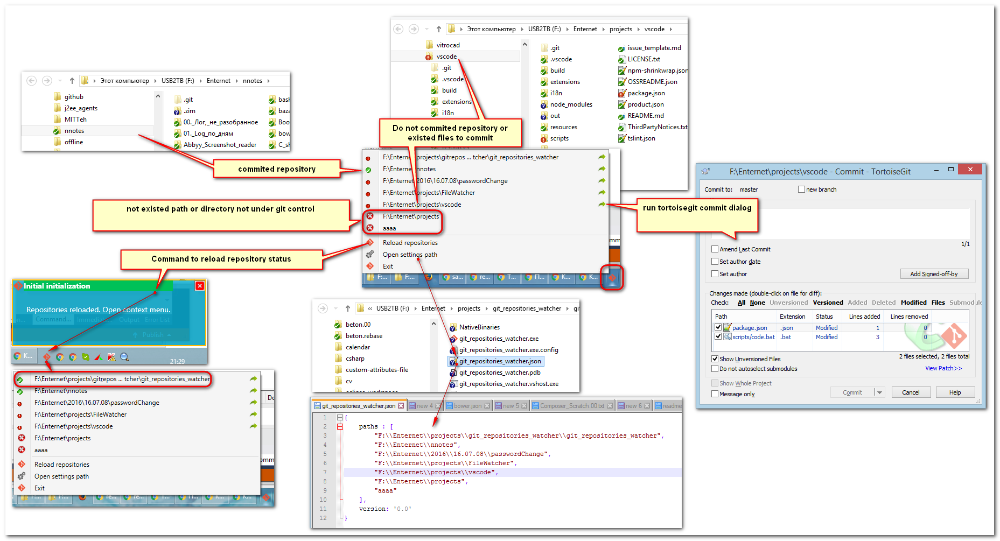

# git_repositories_watcher

Программа висит в трее и показывает контекстное меню со списком каталогов, заданных пользователем в файле git_repositories_watcher.json,
и отображающает статус GIT этих каталогов:

# Краткое описание

Программа состоит из двух файлов: 

- git_repositories_watcher.exe
- git_repositories_watcher.json (генерируется автоматически после первого запуска).

Для работы программы необходима установка **git** (https://git-scm.com/downloads) и **tortoisegit** (https://tortoisegit.org/download/)

Программа не следит за живым обновлением каталогов с репозиториями. Периодически запускайте команду "Reload repository" и 
ждите появления диалогового окна о завершении сканирования репозиториев.