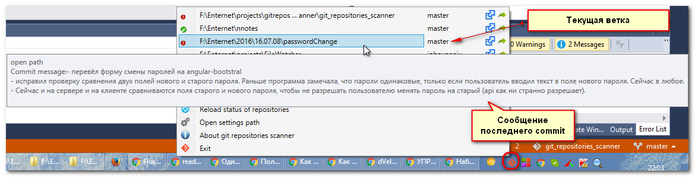

# git_repositories_watcher

Программа висит в трее и показывает контекстное меню со списком каталогов, заданным пользователем,
и отображающая статус GIT этих каталогов:

# Краткое описание

Программа состоит из двух файлов: 

- git_repositories_watcher.exe
- git_repositories_watcher.json

